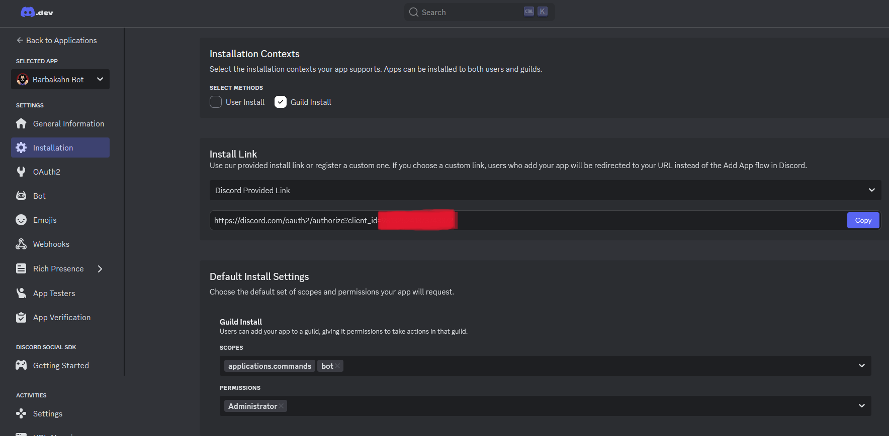
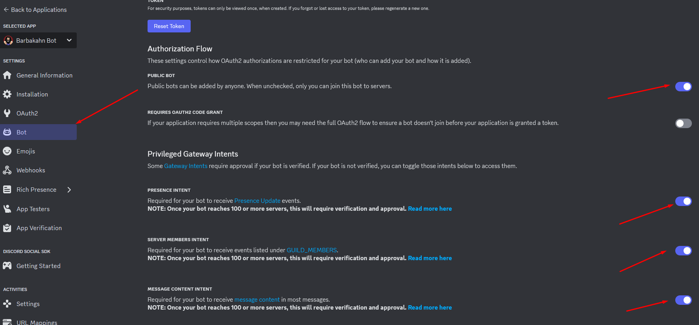
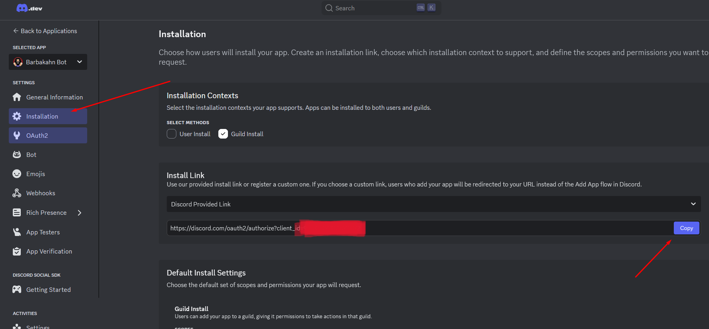

# Barbakahn Bot


Barbakahn Bot es un bot de Discord (2025) que reproduce audios de Barbakahn en tus servidores.

## ¿Cómo crear tu propio bot?

1. Ingresa a [Discord Developer Portal](https://discord.com/developers/applications/).
2. Crea una nueva aplicación y configura tu bot siguiendo las instrucciones.

---

## Configuración




---

## Uso local

Para correr el bot localmente (sin servidor):

```bash
npm start
```

Luego, puedes usar los comandos en Discord escribiendo:

```
b!<nombre_del_audio>
```

Por ejemplo: `b!wtf`

---

¡Disfruta de los audios de Barbakahn en tu servidor!